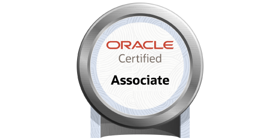

  [Credly]: <https://www.credly.com/users/joe-o-regan> "Credly Profile"

# Certification

View more certification on my [Credly]{:target="_blank"} profile.

## Cloud

AWS Cloud Practioner and Microsoft Azure Fundamentals

    

    

    

## Software

- Java Oracle OCA SE8
- Certified Associate Python Programmer
- Certified Associate JavaScript Programmer

    

        
Oracle Certified Associate Java SE 8

Issuer: Oracle

    

    

    

    

    

    

    

## IT Specialist

Information Technology Specialist certification in Java, Python, JavaScript, Databases, HTML & CSS

    

    

    

    

    

    

## CompTIA

    

    

    

## Microsoft

    

    

    

    

    

